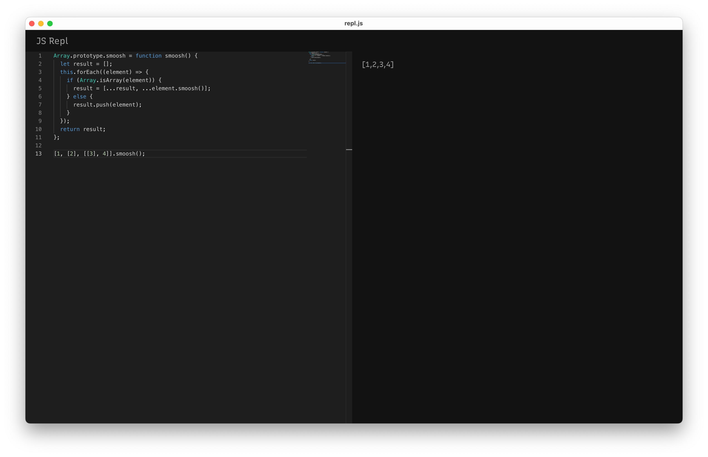

# repl.js

A JS playground built with Rust. Inspired by <a href="https://github.com/lukehaas/RunJS">RunJS</a>. Under the hood,
this uses <a href="https://deno.land/">Deno</a> for it's execution environment, and <a href="https://tauri.app/">Tauri</a> for
native application bindings.



# Roadmap
If you have Rust experience or want to learn, help build features for the Roadmap!

Milestone 1: JS Repl

- [x] The VM interprets JavaScript code and displays the result of running the
      entire script.
- [ ] The VM stops an execution run on demand
- [ ] The UI allows for
  - [ ] changing theme
  - [ ] resizing the result pane
  - [ ] persists the code in the editor between launches
- [ ] Native installers are built using GitHub actions and published on GitHub releases

Milestone 2: Module Support

- [ ] The VM can load ES modules and run them
- [ ] The VM can run a script and report the result asynchronously through a future

Milestone 3: TypeScript support

- [ ] The VM can interpret TypeScript natively using the Deno engine

Milestone 4: Debugging

- [ ] The VM can insert breakpoints, pause the runtime, and report information back to the UI
- [ ] The UI provides the ability to set breakpoints and run code with debugging enabled
- [ ] The UI reports block by block results as opposed to showing the output of running the entire script

# Developing
Install Rust
```shell
curl --proto '=https' --tlsv1.2 -sSf https://sh.rustup.rs | sh
```
Install NodeJS
```shell
brew install node
```

Clone the project
```shell
git clone git@github.com:jasonaibrahim/js-repl.git
```

Start in dev mode
```shell
npm start
```

# Contributing
Fork the project, and raise your first PR.